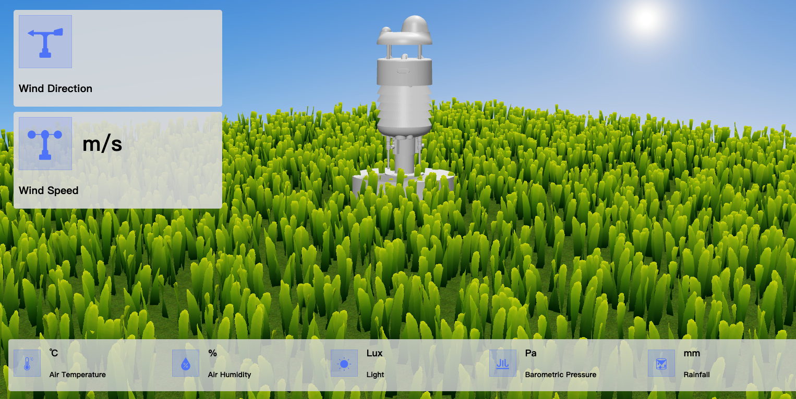

# SenseCAP-WeatherStation-Raspberry-Pi-Visualization

Sensecap One 3D visual web page, that runs on Raspberry Pi.



---

## 1. Prepare

### 1.1 Hardware

- SenseCAP One
- [Raspberry Pi 3B/3B+/4](https://www.seeedstudio.com/Boards-c-17.html)
- [Seeed RS-485 Shield for Raspberry Pi](https://www.seeedstudio.com/RS-485-Shield-for-Raspberry-Pi.html)
    > First of all, the shield needs to be properly plugged in and powered.

### 1.2 Software

- [SenseCAP One Configuration Tool](https://github.com/Seeed-Solution/SenseCAP-One-Configuration-Tool)
    > Connect PC and "SenseCAP One" through a Type-C cable, and then set Sensecap One's protocol to RS485-ASCII by using the software.
- Node.JS v10.22.x
  > If there is not installed on Rapi, try to run the script below, to install a new one.
    ```
    curl -L https://raw.githubusercontent.com/tj/n/master/bin/n -o n
    bash n 10
    ```

---

## 2. How to use

### 2.1 Configure your Raspberry Pi

Using `raspi-config`, to enable the hardware serial `/dev/ttyS0`.

### 2.2 Download source and install

SSH into Raspberry Pi and execute the following command.

```shell
git@github.com:Seeed-Solution/SenseCAP-WeatherStation-Raspberry-Pi-Visualization.git

mv SenseCAP-WeatherStation-Raspberry-Pi-Visualization /opt/SenseCAP-WeatherStation-Raspberry-Pi-Visualization
cd /opt/SenseCAP-WeatherStation-Raspberry-Pi-Visualization

cd server && install --unsafe
cd website && install --unsafe

# pm2 start
npm install -g -y --unsafe pm2 http-server
pm2 start run-server.sh
pm2 start run-website.sh
pm2 save
pm2 ls
```

### 2.3 Access Website

Keep your PC and Raspberry Pi under the same LAN, and then access url [http://{Rapi IP}:8080](http://xx:8080) through your browser.


